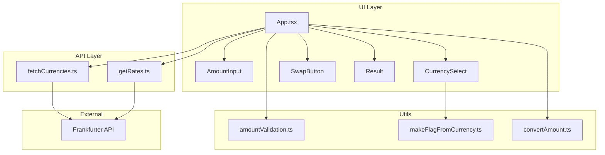

# Currency Converter — Developer Documentation

## Project Overview

This repository contains two related pieces:

1. **`currency-converter/`** — The main application: a browser-based currency converter built with Vite, React, and TypeScript. It loads supported currencies and live exchange rates from the [Frankfurter API](https://www.frankfurter.app/) (free, no API key).
2. **Root-level Node modules** — Standalone JavaScript utilities (`currency-converter.js`, `currency-util.js`) that perform conversions using a static USD-based rate table. These are independent of the web app and useful for scripting or backend-style usage.

The web app is the primary deliverable. All setup, run, build, and test commands below refer to the `currency-converter/` directory unless noted otherwise.

---

## Key Features

### Web application (`currency-converter/`)

- Convert a user-entered amount between two selected currencies
- **Live rates** fetched on demand when the user clicks **Get Exchange Rate**
- **Swap** button to exchange the From and To currencies
- Result line formatted like `100 USD = 92 EUR` (via `Intl.NumberFormat`)
- **Dynamic currency list** loaded from Frankfurter at startup
- **Flag emojis** generated from currency codes when a country code can be derived (no hardcoded flag map)
- **Amount validation**: positive numbers only; max **12 digits** before the decimal, with an inline hint
- **Mutually exclusive selects**: the currency chosen in From is disabled in To (and vice versa)
- **Result lifecycle**: conversion output is cleared when the amount or either currency changes; shown only after a successful conversion
- Accessible labels, focus styles, and `aria-live` on the result area

### Node utilities (repo root)

- `CurrencyConverter` class with static default rates and `convert()` method
- `convertCurrency()` and `getCurrencyRates()` helpers in `currency-util.js`
- CommonJS exports for use in Node scripts

---

## Technical Stack

| Layer | Technology |
|--------|------------|
| UI framework | React 19 |
| Language | TypeScript 6 |
| Build tool | Vite 8 |
| Styling | Plain CSS (`src/index.css`) |
| Exchange data | [Frankfurter API](https://www.frankfurter.app/docs/) |
| Unit tests | Vitest 4, React Testing Library, jsdom |
| Linting | ESLint (TypeScript + React hooks) |

**External API endpoints used by the web app:**

- `GET https://api.frankfurter.app/currencies` — list of supported currencies
- `GET https://api.frankfurter.app/latest?amount={n}&from={code}&to={code}` — conversion for a specific amount

**Note:** Frankfurter does not include every world currency (for example, NPR is not available). The app defaults to **USD → EUR**.

---

## Project Structure

```
Cursor-AI/
├── DOCUMENTATION.md          # This file
├── currency-converter.js     # Node: CurrencyConverter class
├── currency-util.js          # Node: helper functions
└── currency-converter/       # Web application
    ├── index.html
    ├── package.json
    ├── vite.config.ts        # Vite + Vitest config
    ├── README.md
    └── src/
        ├── main.tsx          # App entry
        ├── App.tsx           # State, handlers, layout
        ├── index.css         # Global and card styles
        ├── api/
        │   ├── fetchCurrencies.ts
        │   └── getRates.ts
        ├── components/
        │   ├── AmountInput.tsx
        │   ├── CurrencySelect.tsx
        │   ├── Result.tsx
        │   └── SwapButton.tsx
        ├── utils/
        │   ├── amountValidation.ts
        │   ├── convertAmount.ts
        │   └── makeFlagFromCurrency.ts
        └── test/
            └── setup.ts      # Vitest + jest-dom setup
```

Test files (`*.test.ts`, `*.test.tsx`) live next to the modules they cover.

---

## Prerequisites

- **Node.js** 18 or newer (22 LTS recommended)
- **npm** (bundled with Node.js)
- Network access for Frankfurter API calls when running the web app

---

## Setup Instructions

### Web application

From the repository root:

```bash
cd currency-converter
npm install
```

| Command | Purpose |
|---------|---------|
| `npm run dev` | Start the Vite dev server (default: http://localhost:5173) |
| `npm run build` | Type-check and produce a production build in `dist/` |
| `npm run preview` | Serve the production build locally |
| `npm run test` | Run all unit tests once |
| `npm run test:watch` | Run tests in watch mode |
| `npm run test:ui` | Open the Vitest UI |
| `npm run lint` | Run ESLint |

### Node utilities (optional)

No install step. From the repo root:

```bash
node -e "const { convertCurrency } = require('./currency-util'); console.log(convertCurrency(100, 'USD', 'EUR'));"
```

---

## Usage Guide

### Web application — basic flow

1. **Start the dev server**

   ```bash
   cd currency-converter
   npm run dev
   ```

2. **Open the app** in a browser at the URL shown in the terminal (usually `http://localhost:5173`).

3. **Wait for currencies to load** — the From and To dropdowns populate from Frankfurter. A hint appears until you run a conversion.

4. **Enter an amount** in **Enter Amount** (e.g. `100`). Only positive values are accepted; integer part is limited to 12 digits.

5. **Choose currencies** in **From** and **To**. You cannot select the same code in both lists.

6. **Click Get Exchange Rate** — the app calls Frankfurter and displays a line such as:

   `100 USD = 86.21 EUR`

   (exact values depend on the latest API rates.)

7. **Swap** — click the ↔ control to switch From and To. The previous result is cleared; click **Get Exchange Rate** again to convert with the new pair.

8. **Change amount or currency** — the result area returns to the hint until you convert again.

### Expected behavior (manual checks)

| Action | Expected result |
|--------|-----------------|
| Valid amount + convert | Result line with formatted numbers |
| Amount `0` or empty | Convert button disabled |
| Same currency in both fields | Prevented by disabled options |
| Swap after convert | Currencies swapped, result cleared |
| API or network failure | Error message shown, no stale result |

### Node utilities — programmatic use

```javascript
const { CurrencyConverter } = require('./currency-converter');
const { convertCurrency, getCurrencyRates } = require('./currency-util');

// Class API
const converter = new CurrencyConverter(100, 'USD', 'EUR');
console.log(converter.convert());

// Helper API
console.log(convertCurrency(100, 'USD', 'EUR'));
console.log(getCurrencyRates());
```

Rates in the Node modules are **static defaults** (USD-based table in `CurrencyConverter.DEFAULT_RATES`), not live API data.

---

## Architecture (web app)



**Data flow for a conversion:**

1. On mount, `fetchCurrencies()` loads the currency list.
2. On **Get Exchange Rate**, `getRates(amount, from, to)` returns the converted total in `rates[to]`.
3. `Result` formats `amount`, `from`, and `total` for display.

---

## Testing

Tests use **Vitest** with **jsdom** and **React Testing Library**. Configuration is in `currency-converter/vite.config.ts`; setup imports `@testing-library/jest-dom` in `src/test/setup.ts`.

**Coverage areas:**

- Utilities: amount validation, conversion math, flag generation
- API modules: mocked `fetch` for success and error paths
- Components: rendering, interactions, disabled options
- App: load currencies, convert, clear result on change, swap

Run from `currency-converter/`:

```bash
npm run test
```

All tests should pass before merging changes that touch application logic.

---

## Configuration and environment

- No `.env` file is required; Frankfurter is public and unauthenticated.
- Default currencies: **USD** (from), **EUR** (to), adjusted after the currency list loads if those codes are missing.
- Production output: `currency-converter/dist/` after `npm run build`.

---

## Troubleshooting

| Issue | Likely cause | Suggestion |
|-------|----------------|------------|
| Currencies never load | Network blocked or API down | Check browser devtools Network tab; retry later |
| Convert fails for a pair | Currency not supported by Frankfurter | Choose another currency |
| `npm run build` fails | TypeScript errors | Run `npx tsc -b` in `currency-converter/` for details |
| Tests fail after API URL change | Update mocks in `*.test.ts` | Align test URLs with `fetchCurrencies.ts` / `getRates.ts` |

---

## Related documentation

- App-specific readme: [`currency-converter/README.md`](currency-converter/README.md)
- Frankfurter API docs: https://www.frankfurter.app/docs/
